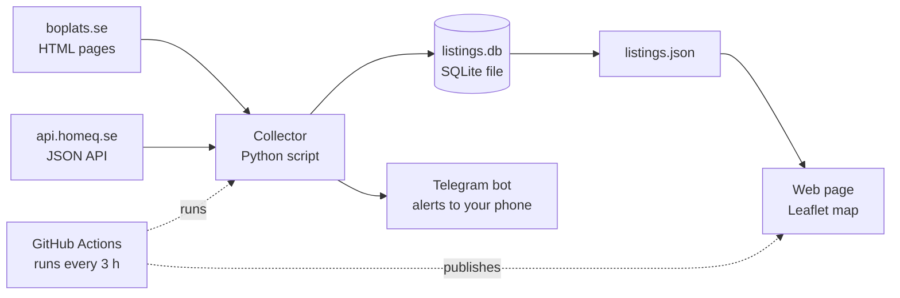

# Bostadskö Tracker — Project Plan

As of 2026-09-18. Author: Jakob Wennerqvist.

## What we're building

A private web page you open each morning that shows every apartment currently listed on Boplats and HomeQ on one map of Göteborg, colour-coded by how realistic each one is for you, plus a Telegram message whenever something new matches your criteria.

The page has three parts. The map: one pin per apartment, green = likely, yellow = possible, grey = out of reach or outside your criteria. Tap a pin for one card with rent, size, rooms, move-in date, deadline, applicant count, the queue time recent winners had, and a link to the original listing. The side panel: your criteria (max rent, min size, rooms, areas) and your live queue counter for both sites. The log: what you've applied to, how many of your five Boplats slots are used, and what happened.

Behind it, a small robot visits both sites every few hours, saves what it finds, and sends you a Telegram message about new matches and deadlines. No servers to pay for, no app store, no login. One web page, one robot, one message channel.

**About the owner, for anyone (or any Claude) working on this:** Jakob is not a developer by trade and has been learning Claude Code for a month or two. Every explanation in this project should be simple and brief, with jargon defined the first time it appears. The tools are chosen for being easy to understand and impossible to break expensively, not for being clever.

## How Boplats and HomeQ work

Both sites reward waiting, but HomeQ lets landlords opt out of the queue for about one listing in five, and both sites show you the one number you need to judge your chances.

| | Boplats Väst | HomeQ |
| --- | --- | --- |
| Cost | 200 kr/year (22+) | Free |
| Queue unit | 1 ködag per day since registration | 1 köpoäng per day since verification |
| Reset | To zero when you sign a contract | To zero when you sign; 90-day wait before applying again |
| Who wins | Longest queue time, always (a few landlords use their own points; the listing says so) | Landlord picks one of four models per listing: strict queue points, points as guidance, first-come, or lottery |
| Share not decided by queue | Near zero | About 20 % (first-come or lottery) |
| Active applications | Fewer than 5 at a time; 6+ declined offers in 6 months blocks you | No hard cap stated |
| Chance signal on listing | Average queue time of winners of similar flats in that area, last 12 months; applicant count "just nu"; after applying, how many are ahead of you | Queue points needed to be in the top 10 applicants right now |
| Income rule | Set by landlord | Typically 3× monthly rent, no payment remarks |
| Göteborg averages | 2 493 days (~6.8 years) at contract, all of 2025, all areas | 3.9 years (1 438 points), Apr–Jun 2026; 1 rum 3.2 y, 2 rum 4.3 y, 3 rum 4.5 y, 4 rum 4.7 y |
| Where the data lives | Plain HTML pages: `boplats.se/sok?types=1hand` (about 107 listings), detail at `boplats.se/objekt/1hand/<id>` | JSON API their own site uses: `POST api.homeq.se/api/v3/cards`, documented, open to any website (CORS) |
| Extra statistics | Power BI dashboard: queue time at contract by year, kommun, stadsdel, size | Quarterly statistics articles |

What the Boplats search page shows per card: area, address, rent, m², floor, rooms, publication date. The detail page adds move-in date, last application date, applicant count, landlord, and the winners' queue time figure. Coordinates are not in the page, so addresses need geocoding (turning an address into a map point) once, then caching.

HomeQ's `cards` endpoint accepts filters for rent, area, rooms, floor, lat/lon and `candidate_sorting_mode` (queue_points / random / first_come_first). Whether it answers without a login is the first thing to verify (see Open questions).

Sources: https://boio.se/ko/koer/boplats-goteborg · https://boplats.se/tipshjalp/kontrakt · https://boplats.se/tipshjalp/statistik · https://www.homeq.se/hemlycka/anvanda-homeq/kopoang-och-uthyrningsprinciper · https://www.homeq.se/hemlycka/anvanda-homeq/kotid · https://api.homeq.se/api-docs/articles/48/ · https://docs-core.homeq.se/ · https://boio.se/ko/koer/homeq

## Features, in priority order

Build in this order; each one is useful on its own before the next exists.

1. **One listing store.** Every apartment from both sites in the same shape (see Data model). A daily snapshot of the fields that change (applicant count, points needed) so history builds up.
2. **Map view.** One pin per listing, coloured by chance score. Click for a card with the essentials and a link to the source. Filter panel beside it.
3. **Criteria profile.** Max rent, min/max m², min rooms, areas (pick stadsdelar or draw a shape on the map), move-in window, and a switch for including first-come/lottery listings. Non-matching pins go grey, not hidden, so you still see the whole market.
4. **Queue tracker.** Enter your Boplats registration date and HomeQ verification date once. The app shows today's days/points and projects forward ("on 1 March 2027 you'll have 1 350 Boplats days").
5. **Chance score per listing** and a "worth applying" shortlist that respects the Boplats limit of fewer than five active applications.
6. **Telegram alerts.** New matches, deadlines within 24 h on listings you care about, and changes in applicant count on ones you've applied to.
7. **Application log.** What you applied to, outcome, and the winner's queue time when you learn it. Over months this becomes your own calibration data.
8. **Instant alert for HomeQ first-come listings** in your criteria. These are won in minutes, so this is the single highest-value notification.

**Left out of v1 on purpose:** auto-applying (Boplats penalises declined offers, and a bot applying for you is how you end up with a flat you don't want), user accounts, a native mobile app, anything that costs money monthly.

## How your chances are estimated

V1 uses three honest buckets, likely / possible / unlikely, driven by the number each site already publishes, then overridden by the allocation model. Precision comes later from your own application log, not from a clever formula.

**Boplats.** Compare your queue days to the listing's "kötid för liknande lägenheter" (average queue time of recent winners in that area).

| Your days vs. winners' average | Bucket |
| --- | --- |
| ≥ 110 % | Likely |
| 80–110 % | Possible |
| < 80 % | Unlikely |

Applicant count adjusts one step: 0–5 applicants within three days of the deadline bumps up a bucket; 50+ bumps down. Once you've applied, the site tells you how many are ahead; store that, it beats any estimate. Later, pull the Power BI statistics by stadsdel and room count to replace the single average with a distribution.

**HomeQ.** Depends entirely on the listing's allocation model.

| Model | How to score |
| --- | --- |
| Strict queue points | Your points vs. "points needed for top 10": ≥ that = likely, within 10 % below = possible, else unlikely |
| Points as guidance | One bucket lower than strict; the personal letter and a stable income are your lever |
| First-come | Points irrelevant. Likely if you apply in the first minutes, else unlikely |
| Lottery | Roughly 1 ÷ applicants; show as possible with the odds written out |

For context today: about 3 years 2 months on Boplats is roughly 1 150–1 200 days, below the Boplats all-area average and below HomeQ's 1-rum Göteborg average. The map will therefore light up mostly in peripheral areas and smaller flats, which is exactly the signal it should make obvious at a glance.

## How it's built

Four pieces, all free, no server to keep alive. You are the only user, so the goal is zero monthly cost and nothing to babysit.



GitHub Actions wakes the collector every few hours; it reads both sites, updates the database, exports a JSON file, sends any alerts, and republishes the web page.

| Piece | Choice | Why, in plain terms |
| --- | --- | --- |
| Collector | Python with `requests` + `BeautifulSoup` | The simplest way to fetch a web page and pull out text. Several public Boplats scrapers already use exactly this |
| Storage | SQLite (one file, `listings.db`) | A whole database in a single file. No install, no server, no password. Ships with Python |
| Export | `listings.json` | The web page reads one plain file; no backend needed |
| Web page | Plain HTML + JavaScript with Leaflet and OpenStreetMap tiles | Leaflet is the standard free map library; a map with pins is about 20 lines |
| Hosting | GitHub Pages | Free static hosting straight from the repo. Cloudflare Pages is the equivalent fallback |
| Scheduler | GitHub Actions cron | Free for public repos and generous for private ones; runs while your laptop is closed |
| Alerts | Telegram bot | Two minutes to set up, one line of code to send, buzzes your phone instantly, free |
| Geocoding | Nominatim (OpenStreetMap), 1 request/second, cached forever by address | Free; only runs once per new address |
| Settings | `me.json` in the repo (queue dates, criteria) plus browser localStorage for quick tweaks | No accounts, no database of users |

**Be a polite visitor.** Poll every 3–4 hours, never re-fetch a listing you already have, send one request at a time with a short pause, and set a descriptive `User-Agent`. Read both sites' terms once before the first real run. Listings do not change faster than this anyway.

If you later want a real backend (login, several users), FastAPI on top of the same SQLite file is an afternoon's work. Don't start there.

## Data model

Three tables. `listings` is one row per apartment; `snapshots` records the changing numbers once per run; `applications` is your log.

**listings**

| Field | Type | Notes |
| --- | --- | --- |
| id | text | `boplats:<id>` or `homeq:<id>` |
| source | text | `boplats` / `homeq` |
| url | text | Link to the original |
| address, area, kommun | text | Area = stadsdel as the site names it |
| lat, lon | real | From the site or geocoded once |
| rent_sek | integer | Per month |
| size_m2 | real | |
| rooms | real | 1.5 allowed |
| floor | integer | Null if unknown |
| move_in | date | |
| deadline | date | Last application date |
| landlord | text | |
| allocation | text | `queue` / `queue_guidance` / `first_come` / `lottery` / `points_landlord` |
| winners_queue_days | integer | Boplats "kötid för liknande" converted to days |
| first_seen, last_seen | datetime | `last_seen` older than 2 runs = closed |
| status | text | `active` / `closed` |

**snapshots**: `listing_id`, `taken_at`, `applicants`, `points_needed_top10`. One row per listing per run.

**applications**: `listing_id`, `applied_at`, `my_days_at_apply`, `ahead_of_me` (Boplats tells you), `outcome` (`pending` / `viewing` / `offered` / `declined` / `lost`), `winner_queue_days`, `notes`.

`listings.json` is `listings` joined with each row's latest snapshot, plus your computed `score` and `bucket`, so the web page never has to calculate anything.

## Build plan

Four weeks of evenings, data first, screen second. Each week ends with something you can actually use.

| Week | Build | Done when |
| --- | --- | --- |
| 1 — Data | Repo, `CLAUDE.md`, Boplats collector writing to SQLite, then the HomeQ collector once you've captured its real request in the browser's DevTools, then geocoding with a cache | Running `python collect.py` twice in a row adds no duplicates, and `listings.json` has correct rent, m², rooms, address and coordinates for every active listing on both sites |
| 2 — Map | Static page with Leaflet, pins from `listings.json`, click-for-card, criteria panel, grey-out logic, deployed to GitHub Pages | You open the page on your phone and can see and filter every listing |
| 3 — Queue and score | Your two queue dates, the live counter and projection, the three-bucket score with allocation-model overrides, pin colours, the application log | Pins are coloured, and a listing you'd realistically win is green |
| 4 — Automation | GitHub Actions cron every 3 h, Telegram bot, new-match and deadline alerts, first-come instant alert | You get a Telegram message about a new listing without having touched anything |

Then use it daily for two weeks before deciding what v2 is. The friction you feel is the roadmap.

**Working rhythm in Claude Code.** One feature per session. Start each session by saying what "done" looks like in one sentence. Ask Claude to explain any file it creates in two or three plain sentences before moving on. Commit after every session that works (`git commit`), so you can always go back.

## Your first Claude Code session

Goal of session one: a working Boplats collector that writes real listings into SQLite. Nothing else.

1. Make a folder, e.g. `bostadsko-tracker`, and open a terminal there (in WSL, as you've set up).
2. Run `git init`, then put `CLAUDE.md` and this `PLAN.md` in the folder.
3. Start Claude Code (`claude`) and paste the prompt below.
4. When it finishes, run `python collect.py --no-alert` yourself and open `data/listings.db` with any SQLite viewer (or ask Claude to print ten rows). Check three listings by hand against boplats.se.
5. Commit: `git add -A && git commit -m "Boplats collector writes listings to SQLite"`.

**First prompt:**

```text
Read CLAUDE.md and PLAN.md first, then explain back to me in five plain
sentences what we're building and how you plan to approach today's task.

Today's task: build the Boplats collector only.

1. Create store.py with the SQLite schema from PLAN.md ("Data model"):
   tables listings, snapshots, applications. Include an upsert function
   that inserts a new listing or updates last_seen on an existing one, and
   a snapshot function.
2. Create collectors/boplats.py. Fetch https://boplats.se/sok?types=1hand
   and parse every listing card (area, address, rent, m², rooms, floor,
   publication date, URL). Then, only for listings not already in the
   database, fetch the detail page and add move-in date, last application
   date, applicant count, landlord and the "kötid för liknande lägenheter"
   figure converted to days. Pause 1.5 s between requests and set a
   User-Agent like "bostadsko-tracker (personal use)".
3. Save one search page and one detail page as HTML in tests/samples/
   and write parser tests against them.
4. Create collect.py that runs the Boplats collector, upserts, snapshots,
   and exports site/listings.json.

Skip HomeQ, geocoding, scoring, the map and Telegram for today.
After each file, tell me what it does in 2–3 sentences. Stop and ask me
if the page structure doesn't match what PLAN.md describes.
```

Session two is the HomeQ collector. Before that session, open homeq.se/lediga-lagenheter/goteborg in Chrome, press F12, choose the Network tab, filter on `cards`, and copy the request as cURL (right-click the request → Copy → Copy as cURL). Paste that into Claude Code; it has everything needed to replicate the call.

## Open questions

- [ ] Does `POST api.homeq.se/api/v3/cards` answer without a login? Their docs say it's open to any website, but it hasn't been tested with a POST yet. Verify with DevTools before session two.
- [ ] Does HomeQ's response include "points needed for top 10" and the allocation model, or is that only on the detail page? Decides whether HomeQ needs a second request per listing.
- [ ] Do Boplats detail pages still carry coordinates? An older scraper read `data-latitude` from the page; a recent fetch didn't show it. If not, Nominatim geocoding is the fallback.
- [ ] Read both sites' user terms once for anything about automated access, and keep the polling gentle regardless.
- [ ] Your exact Boplats registration date and HomeQ verification date, for the queue counter.
- [ ] Your starting criteria: max rent, min m², rooms, and which stadsdelar you'd actually live in.
- [x] Alerts: Telegram (decided 2026-09-18).
- [ ] Public or private GitHub repo? Public gives unlimited Actions minutes; private is plenty for a run every 3 h but keep `me.local.json` and the Telegram token out of git either way.
